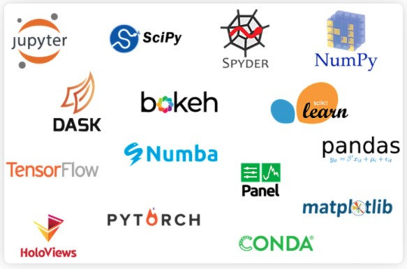
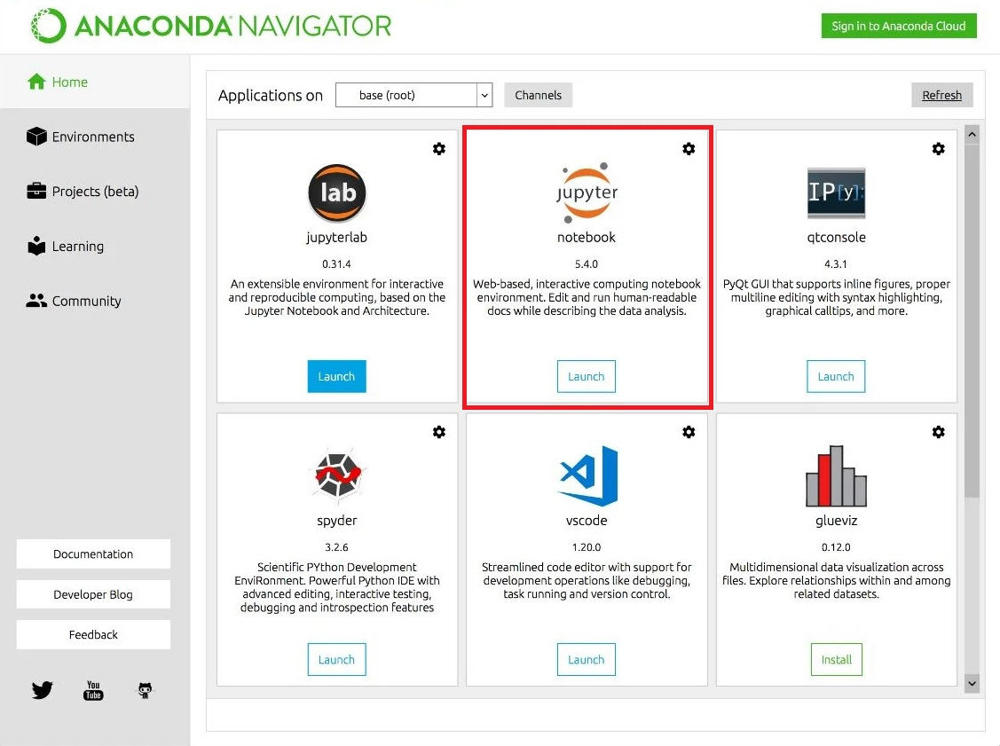
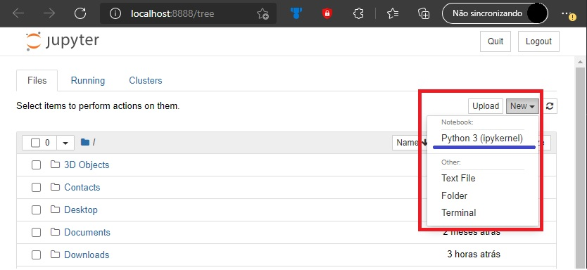

# Minicurso sobre a linguagem de programção Python

## Introdução
Seja bem vindo(a) ao nosso tutorial sobre a linguagem de programação Python. Durante esse minicurso, iremos aprender como instalar o Python no computador, aprender sobre  a ferramenta Anaconda e como utilizá-la, dando ênfase maior sobre o Jupyter Notebook, que é uma outra ferramenta incorporada ao Anaconda.
Com isso, será apresentada a estrutura geral do Python, partindo de um simples "Hello World", aprendendo como é a estrutura de laços de repetição e aprofundando funções Lambda, por exemplo. Ao fim desse minicurso, você estará mais do que preparado para, por exemplo, utilizar o framework Django, para desenvolvimento web, que utiliza Python, que será ensinando após o tutorial sobre Python.

## Sumário

O minicurso seguirá uma ordem de conteúdos, como pode ser vista na lista abaixo:

1. O que é Python
2. O que é Django
3. O que é o Anaconda
4. O que é o Jupyter Notebook
5. Como instalar o Anaconda
6. Como utilizar o Jupyter Notebook
7. Introdução à linguagem de programação Python

## 1. O que é Python
É uma liguagem de programação de alto nível, interpretada de script, imperativa, orientada a objetos, funcional e de tipagem dinâmica e forte. Foi lançada por Guido Van Rossum em 1991. A linguagem vem com o propósito de enfatizar o esforço do programador e prioriza a legibilidade do código sobre a velocidade.

Neste minicurso vamos aprender um pouco sobre Python e incluiremos alguns conceitos de Django.

## 2. O que é Django
É um framework para desenvolvimento rápido para web e um design limpo, escrito em Python, que utiliza o padrão model-template-view. Vem com a proposta de ajudar aos desenvolvedores a criar aplicações de forma rápida,evita erros comuns de segurança, e com muita facilidade de escalar.

## 3. O que é o Anaconda
Anaconda cria um ambiente com todas as bibliotecas e ferramentas necessárias para a utilização das funcionalidades da linguagem, com isso instala o Jupyter, utilizando apenas importações no código para utilizar bibliotecas, sem precisas instalá-las.

Abaixo está algumas aplicações que o Anaconda instala.

## 4. O que é o Jupyter Notebook
É uma aplicação web open-source bastante utilizada para realizar projetos utilizando a linguagem python. Uma grande vantagem dele é que ajuda bastante no processo de documentação, além do código em si. Ele trabalha com células em que podem ser criado textos ou códigos.

## 5. Como instalar o Anaconda
Para baixar o Anaconda, basta entrar no seguinte link: https://www.anaconda.com/distribution/

E descer na página até encontrar a seguinte seção:

Selecione o sistema operacional e baixe o anaconda para a versão 3.7 do Python. É importante lembrar que o Anaconda já vem com Python instalado. Abra o instalador do Anaconda, basta seguir o procedimento padrão de instalação e você terá ele instalado.

## 6. Como utilizar o Jupyter Notebook
Após a instalação do Anaconda, abra-o e mostrará a seguinte tela.

A partir desta tela, basta clicar em Launch, abaixo do Jupyter.

Ao fazer isso, você será direcionado para uma página web no seu navegador com o Jupyter funcionando.

Nesta janela você poderá navegar pelas pastas do seu computador, assim como manipulá-las. Na imagem a seguir se pode ver que, na região em destaque, ao clicar em New Também é possível abrir um terminal, criar pastas (Folder), arquivos de textos (Text File) e o mais importante para nós nesse minicurso, que é a possibilidade de criar um Notebook, em Python 3.

A imagem abaixo mostra como é um Notebook com alguns códigos e markdown. É possivel incluir novas células no menu superior em inserir.

[IMAGEM]

O Jupyter permite que seja executada várias células ou apenas uma na aba Cell. Na aba Kernel é possivel pausar a execução ou recomeçá-lo, netre outras atividades.
